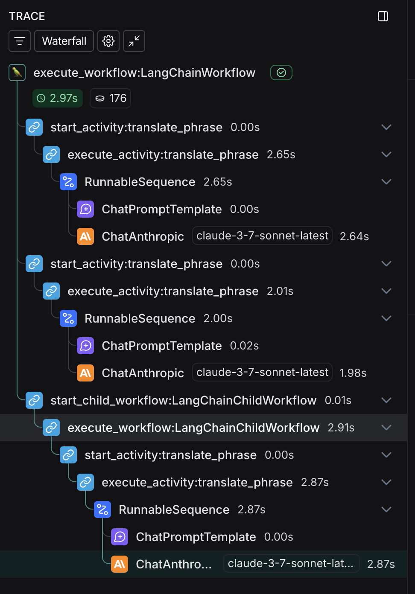

# LangChain Sample

This sample shows you how you can use Temporal to orchestrate workflows for [LangChain](https://www.langchain.com). It includes an interceptor that makes LangSmith traces work seamlessly across Temporal clients, workflows and activities.

For this sample, the optional `langchain` dependency group must be included. To include, run:

    uv sync --group langchain

Create a .env file in the root directory with the following content:

    ANTHROPIC_API_KEY=YOUR_API_KEY

[Anthropic API key](https://docs.anthropic.com/en/api/overview)

Requirements

- Python 3.13+
- Temporal Server (temporal server start-dev)
- python uv

worker:

    uv run langchain/worker.py

This will start the worker. Then, in another terminal, run the following to execute a workflow:

    uv run langchain/starter.py

Then, in another terminal, run the following command to translate a phrase:

    curl -X POST "http://localhost:8000/translate?phrase=hello%20world&language1=Spanish&language2=French&language3=Russian"

Which should produce some output like:

    {"translations":{"French":"Bonjour tout le monde","Russian":"Привет, мир","Spanish":"Hola mundo"}}

Check [LangSmith](https://smith.langchain.com/) for the corresponding trace.

